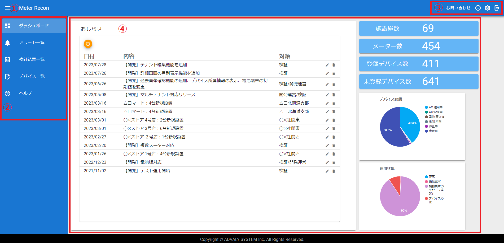
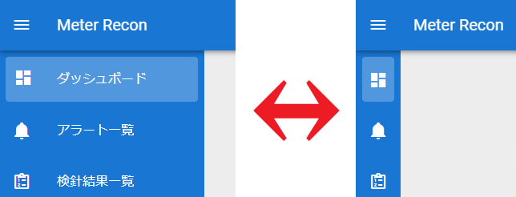
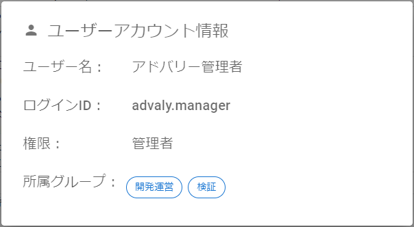

# 2. 画面構成

---
## 概要

- ① サイドバー表示 切り替えボタン　⇒サイドバーを簡易表示に切り替えます。
- ② 管理操作　⇒アカウント情報表示、管理メニュー表示、ログアウト等を操作します。
- ③ サイドバー　⇒メニューから表示したい画面を選択します。
- ④ 設定画面　⇒メニューに対応した設定画面を表示します。

---
## 2.1 サイドバー表示切り替えボタン

 ボタンをクリックすると、サイドバーの簡易表示/詳細表示を切り替えます。

---
## 2.2 お問い合わせ

 ボタンをクリックすると、お問い合わせフォームを開きます。

---
## 2.3 アカウント情報

 ボタンをクリックすると、アカウント情報を開きます。

---
## 2.4 管理メニュー

 ボタンをクリックすると、管理メニュー画面を表示します。画面については後節で説明します。

---
## 2.5 ログアウト

 ボタンをクリックすると、ログアウトします。

