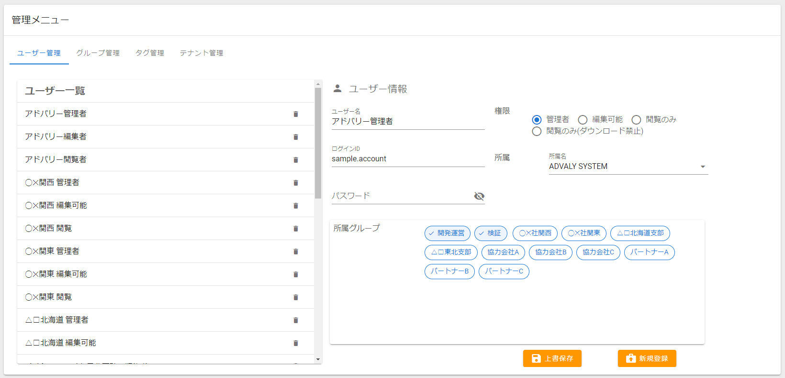
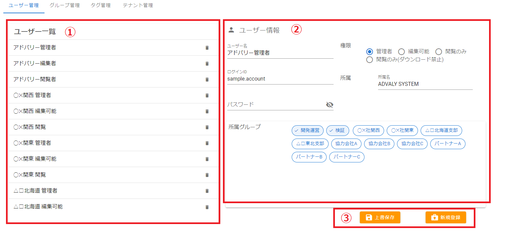
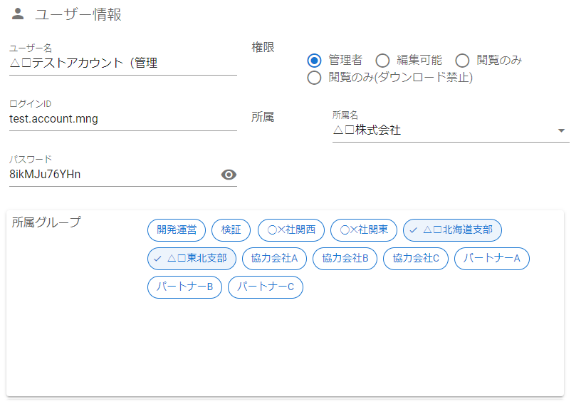
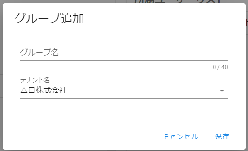
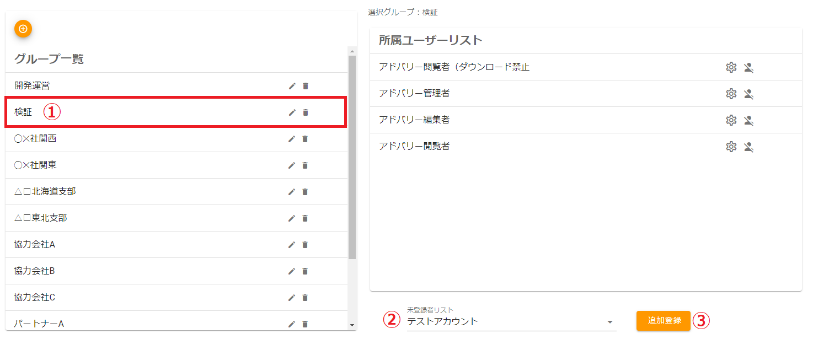

# 管理メニュー

管理メニューには、「ユーザー管理」、「グループ管理」、「タグ管理」、「テナント管理」があり、それぞれの画面はタブで切り替えます。

※管理メニューの内容はログインアカウントの権限によって異なります。

- 「統括管理テナント」に所属 かつ「管理者」⇒全てのメニューが表示されます。
- 「一般テナント」に所属 かつ「管理者」⇒「ユーザー管理」「グループ管理」「タグ管理」が表示されます。
- 「編集可能」⇒「タグ管理」のみ表示されます。
- 「閲覧のみ」⇒管理メニュー自体を表示できません。

---
## ユーザー管理

- ① ユーザー一覧　⇒登録されているユーザー名を表示します。クリックするとユーザー情報が右側に表示されます。
- ② ユーザー情報　⇒選択されたユーザーのアカウント情報を表示します。
　■ アカウント情報
　・ユーザー名　：システム上の表示名
　・ログインID　：ログイン時に指定するID
　・パスワード　：ログイン時に指定するパスワード
　・権限　：ユーザーが操作可能な範囲
　・所属　：ユーザーが所属するテナント　※「統括管理テナント」の「管理者」のみ変更可能
　・所属グループ　：ユーザーが所属するグループ
- ③ 上書保存/新規保存　⇒表示内容で上書き、または新規保存します。

---
### ユーザーを新規に登録する
ユーザー情報を入力します。入力制限がある場合はガイドに従ってください。

 ボタンをクリックします。

※以下の場合は、登録できませんのでご注意ください。
- 入力内容に不備がある場合
- ログインIDが重複する場合

---
### ユーザーの登録情報を変更する
変更したいユーザーを一覧から選択し、ユーザー情報を書き換えます。

 ボタンをクリックします。

※パスワードを空欄のまま上書保存した場合、以前のパスワードが引き継がれます。

---
### ユーザーを削除する
ユーザー一覧から目的のユーザーを探し、右側の  ボタンをクリックします。

確認ダイアログが表示されるので、問題なければ「削除する」をクリックしてください。

---
## グループ管理

- ① グループ一覧　⇒登録されているグループを一覧表示します。
- ② 選択グループ　⇒現在選択中のグループです。
- ③ 所属ユーザーリスト　⇒選択中のグループに所属しているユーザーです。
- ④ 未登録者リスト　⇒グループに所属していないユーザーを追加登録できます。

---
### グループを新規作成する
 ボタンをクリックします。

グループ追加ダイアログが表示されるので、目的のグループ名を入力して「保存」ボタンをクリックします。

操作が成功すると追加したグループ名がグループ一覧に表示されます。

※「テナント名」選択は、操作ユーザーが「統括管理テナント」の「管理者」である場合のみ表示されます

---
### グループ名を変更する
変更したいグループの  ボタンをクリックします。

グループ編集ダイアログが表示されるので、グループ名を変更して「保存」ボタンをクリックします。

※影響が大きいため、テナントの変更は不可とします

---
### グループを削除する
グループ一覧から目的のグループを探し、右側の  ボタンをクリックします。

グループに登録されているユーザーとデバイスが存在しない場合は即時削除されます。

登録ユーザーや登録デバイスが残っている場合は、以下の警告が表示され削除されません。

その場合、グループに紐づくユーザーとデバイスをすべて解除してから再度実行してください。

---
### グループにユーザーを追加する

① グループ一覧から目的のグループを選択します。

② 未登録者リストからグループに追加したいユーザーを選択します。

③  ボタンをクリックします。

---
### グループからユーザーを削除する
所属ユーザーリストから目的のユーザーを探し、右側の  ボタンをクリックします。

---
## タグ管理

- ① 所属グループ選択　⇒タグは所属グループ毎に設定します。対象となる所属グループをリストから選択してください。
- ② タググループ追加ボタン　⇒タググループを追加します。
- ③ タググループリスト　⇒現在登録されているタググループの一覧です。
- ④ タグリスト　⇒選択されたタググループに登録されているタグの一覧です。
- ⑤ タグ追加ボタン　⇒選択中のタググループに新たなタグを追加します。

---
### タググループ追加
タググループ追加ボタン  をクリックすると以下のダイアログが開きます。

任意のタググループ名を入力し、``保存``ボタンをクリックしてください。

一覧に保存したタググループ名が追加されます。

---
### タグ追加
タググループにタグを追加します。任意のタググループを選択し、タグ追加ボタン  をクリックします。

以下のダイアログが開きます。

任意のタグ名を入力し、``保存``ボタンをクリックしてください。

一覧に保存したタグ名が追加されます。

---
### タググループ編集
目的のボタンをクリックし、タググループ名を編集してください。

：編集ボタン　：削除ボタン

※タググループを削除すると**配下に紐づいているタグもすべて削除されます**。既にメーターに設定されているタグがある場合、メーター設定から削除されるのでご注意ください。

---
### タグ編集
編集したいタグをクリックしてください。

以下のダイアログが開きます。

タグ名を変更したい場合は、タグ名を書き換えて``保存``ボタンをクリックしてください。

一覧に編集したタグ名が表示されます。

タグを削除したい場合は``削除``ボタンをクリックしてください。
※タグを削除するとメーター設定からも自動的に解除されるのでご注意ください。
