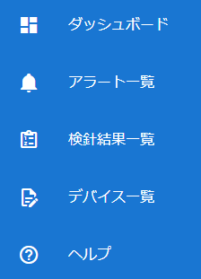

# サイドバー

クリックしたメニューに対応する設定画面を表示します。

- **ダッシュボード**　⇒全体の概要を表示します。
- **アラート一覧**　⇒発生したアラートの一覧を表示します。
- **検針結果一覧**　⇒OCRカメラから受信した検針結果を表示します。
- **デバイス一覧**　⇒OCRカメラの登録、設定変更をします。
- **ヘルプ**　⇒マニュアルなど、関連するドキュメントを表示します。
