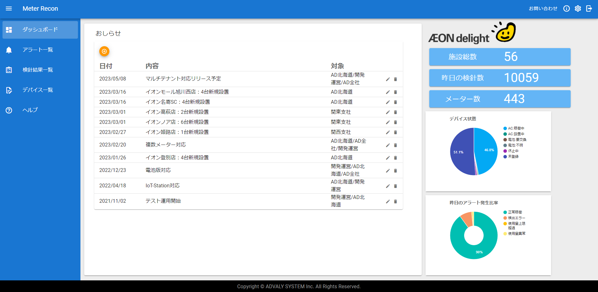
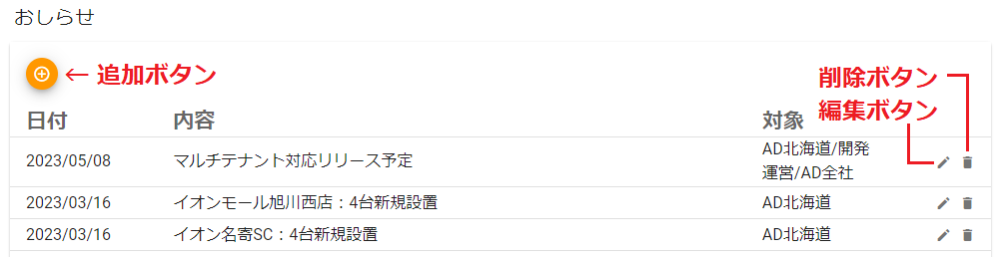
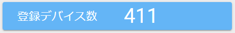
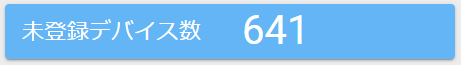
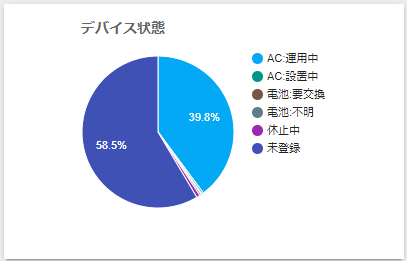
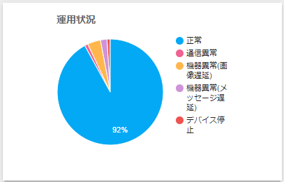

# 5. ダッシュボード

おしらせや運用状態の概要を表示します。

- **おしらせ**　⇒おしらせを表示します。

※追加ボタン、編集ボタン、削除ボタンは管理者権限を持つユーザーのみ表示されます。

- **施設総数**　⇒登録されている施設の総数を表示します。

- **メーター数**　⇒登録されているメーターの総数を表示します。

- **登録デバイス数**　⇒登録されているデバイスの総数を表示します。

- **未登録デバイス数**　⇒未登録となっているデバイスの総数を表示します。

- **デバイス状態**　⇒全デバイスの状態を表示します。

- **運用状況**　⇒デバイスの運用状況を円グラフで表示します。

