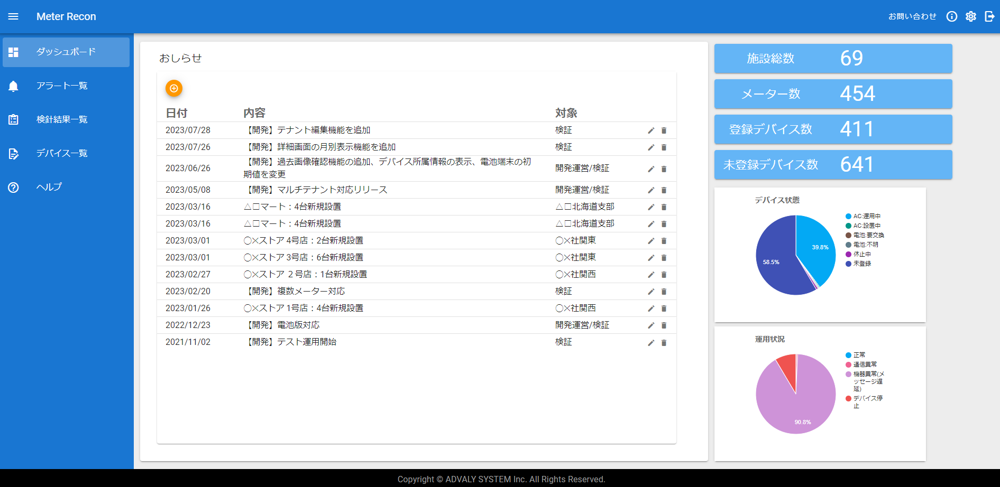
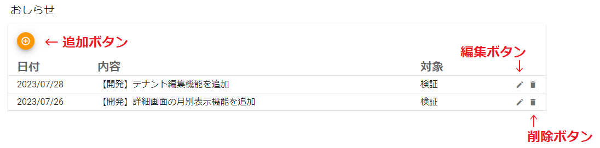
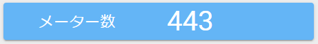

# ダッシュボード

おしらせや運用状態の概要を表示します。

- **おしらせ**　⇒おしらせを表示します。

※追加ボタン、編集ボタン、削除ボタンは管理者権限を持つユーザーのみ表示されます。

- **施設総数**　⇒登録されている施設の総数を表示します。

- **昨日の検針数**　⇒昨日受信した検針結果の数を表示します。

- **メーター数**　⇒登録されているメーターの総数を表示します。

- **デバイス状態**　⇒全デバイスの状態を表示します。

- **昨日のアラート発生比率**　⇒カメラの稼働状況を円グラフで表示します。

稼働状況の種別は以下の通りです。

**「正常稼働」　「検出エラー」　「使用量上限超過」　「使用量異常」**

※マウスオーバーで詳細が表示されます。また、クリックするとアラート一覧に移動します。
