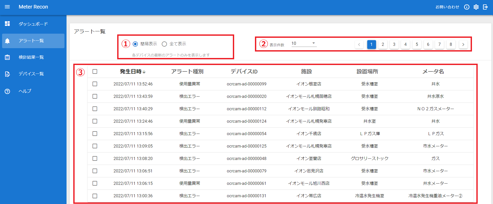
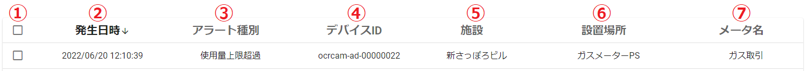
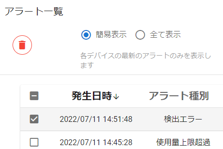
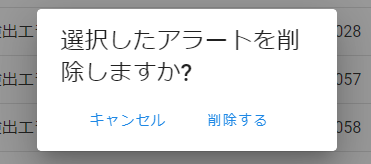

# 6. アラート一覧

発生したアラートの一覧を表示します。

- ① 表示切替
- ② ページ選択
- ③ アラート一覧

---
## 6.1 表示切替

- **簡易表示**

各デバイスの最新のアラートのみを表示します。

- **全て表示**

全てのアラートを表示します。

---
## 6.2 ページ選択

1ページに表示する件数を選択します。

アラート件数が多い場合は、ページボタンを切り替えて表示します。

---
## 6.3 アラート一覧
発生しているアラートの一覧を表示します。

- ① チェックボックス　⇒チェックを付けると削除ボタンが左上に現れます。
- ② 発生日時　⇒アラートの発生日時です。
- ③ アラート種別　⇒
**「検出エラー」　「使用量上限超過」　「使用量異常」**

- ④ デバイスID　⇒アラートが発生したOCRカメラのデバイスIDです。
- ⑤ 施設　⇒アラートが発生したOCRカメラに設定されている施設名です。
- ⑥ 設置場所　⇒アラートが発生したOCRカメラに設定されている設置場所です。
- ⑦ メータ名　⇒アラートが発生したOCRカメラに設定されているメーター名です。

**一覧から任意のアラートをクリックすると、対象となるOCRカメラの詳細画面に移動します。**

---
### 6.3.1 アラート削除
チェックボックスをクリックしてチェックを付けると``削除ボタン``が左上に現れます。

``削除ボタン``をクリックすると確認メッセージが表示され、``削除する``を選択するとアラートが削除されます。

