# 検針結果一覧
OCRカメラから受信した検針結果を表示します。
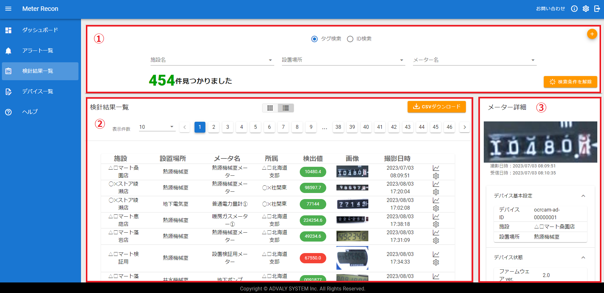

- ① 検索フォーム　⇒条件を指定して検針結果を絞り込みます。
- ② 検針結果一覧　⇒条件に一致する検針結果を表示します。
- ③ メーター詳細　⇒一覧で選択した検針結果のメーター詳細情報です。

---
## 検索フォーム
条件を指定して検針結果を絞り込みます。

- ① タグ検索/ID検索 切り替え　⇒切り替えると検索条件が変わります。

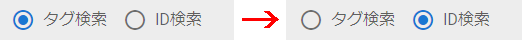

- ② 検索条件　⇒条件を指定して検針結果を絞り込みます。

**タグ検索**　施設名、設置場所、メーター名を検索条件とします。

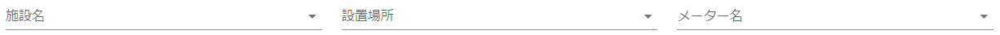

**ID検索**　デバイスIDを検索条件とします。

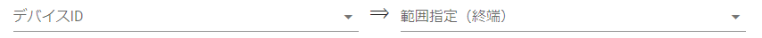

- ③ タグ選択　⇒選択したタグを検索条件に加えます。

**タグ**　登録されているすべてのタグを表示します。

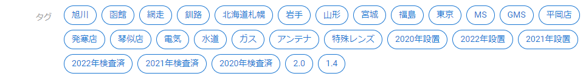

- ④ ヒット件数　⇒検索条件に一致する件数です。

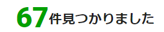

- ⑤ 検索条件解除ボタン　⇒現在選択されている検索条件をすべて解除します。

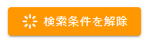

- ⑥ 簡易表示ボタン　⇒タグ選択の表示/非表示を切り替えます。

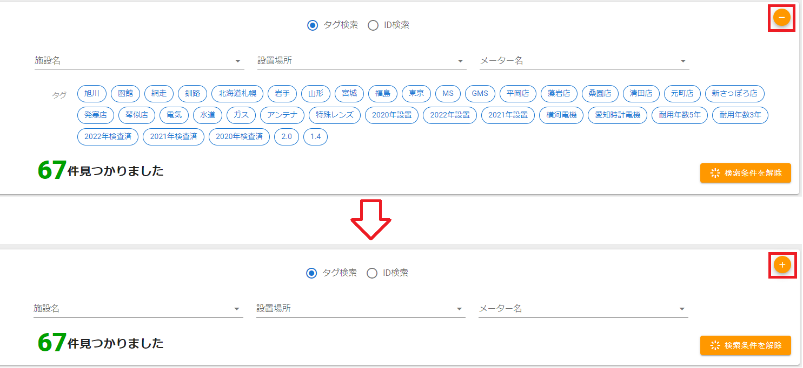

**使用例：施設名で絞り込む場合**

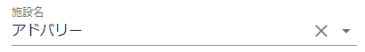
``施設名``から、目的の施設を選択します。

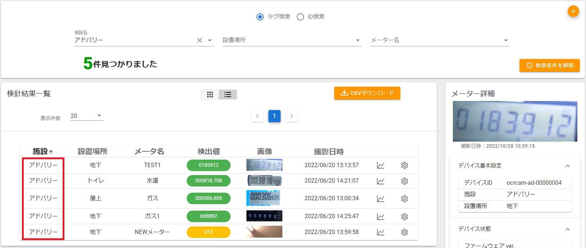

該当施設の検針結果のみ表示されます。

---
## 検針結果一覧
検針結果の一覧を表示します。

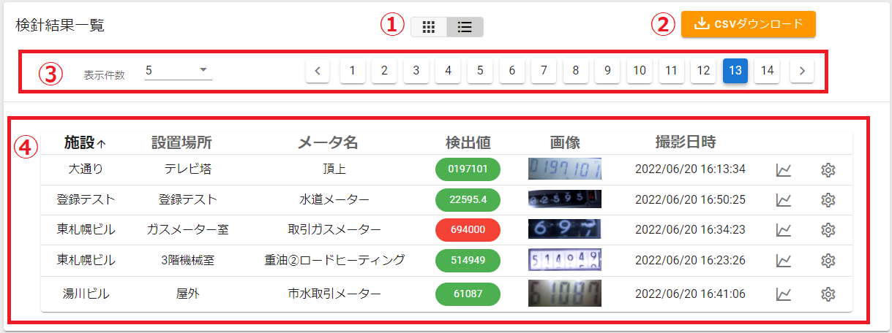

- ① タイル表示/ライン表示 切り替え
- ② CSVダウンロードボタン
- ③ ページ選択
- ④ 検針結果一覧

---
### タイル表示/ライン表示 切り替え
タイル表示とライン表示を切り替えることができます。
- **タイル表示**

　左側のボタンをクリックするとタイル表示になります。

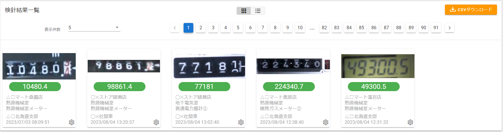

- **ライン表示**

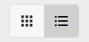
　右側のボタンをクリックするとライン表示になります。

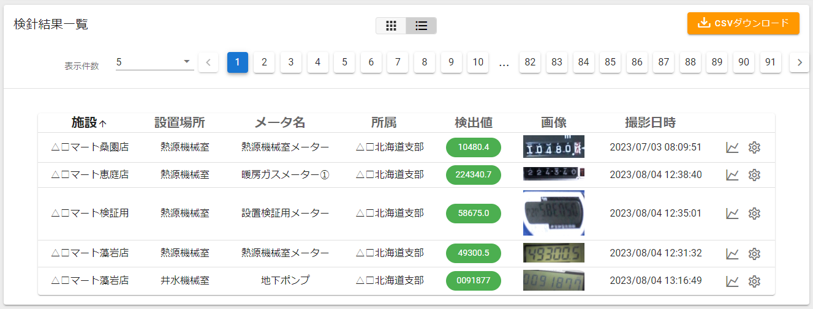

---
### CSVダウンロードボタン
収集したOCRデータをCSV形式ファイルとしてダウンロードできます。

``CSVダウンロード``ボタンをクリックすると以下のダイアログが開きます。

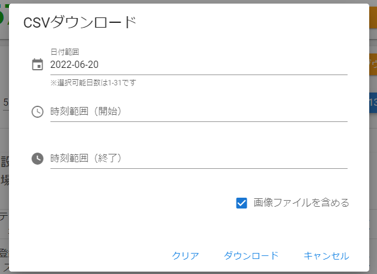

- **日付範囲**　　デフォルトで当日が設定されています。クリックするとカレンダーが開きます。

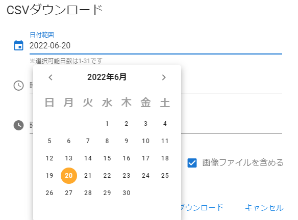

日付が選択されている状態で他の日を選択すると範囲指定になります。

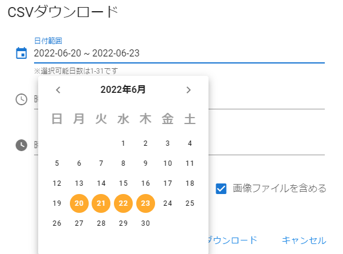

- **時刻範囲（開始）**　　
取得開始時刻を指定します。クリックするとタイムピッカーが開きます。

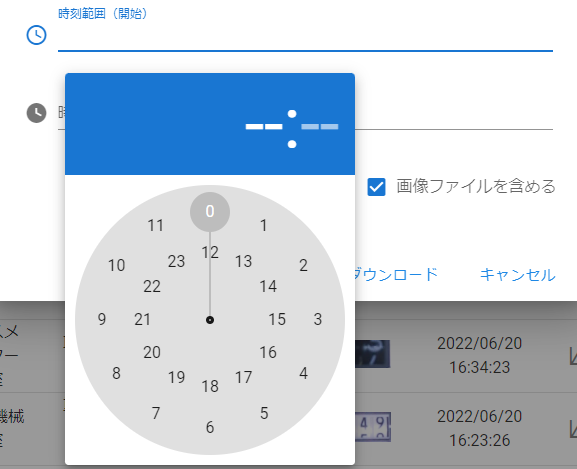

時間と分を選択します。※時間は24時間表記です。

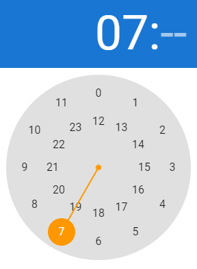
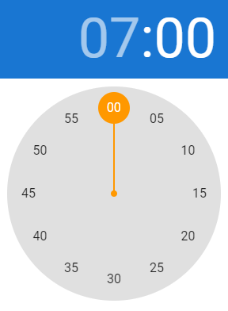

設定後、終了時刻が自動的に決まります。（１時間後）

変更したい場合は、``時刻範囲（終了）``を設定してください。

- **時刻範囲（終了）**　　終了時刻を指定します。クリックするとタイムピッカーが開きますので、開始時刻と同様に設定してください。

- **画像ファイルを含める**　　チェックをつけるとメーター画像もダウンロードします。チェックを外すとCSVファイルのみダウンロードします。

``ダウンロード``をクリックすると指定した条件でダウンロードが始まります。（zip圧縮ファイルの状態でダウンロードされます）

``クリア``で日付が当日に戻り、時刻範囲がクリアされます。

``キャンセル``で何もせずにダイアログを閉じます。

---
### ページ選択

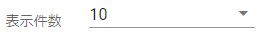

1ページに表示する件数を選択します。

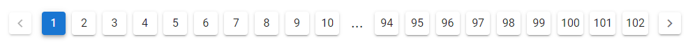

検針結果が多い場合は、ページボタンを切り替えて表示します。

---
### 検針結果一覧
検針結果の一覧を表示します。表示形式はタイル表示とライン表示の二種類があります。

- **タイル表示**

- ① OCRカメラ画像
- ② メーター値
- ③ 施設名
- ④ 設置場所
- ⑤ メーター名
- ⑥ 所属グループ
- ⑦ 検針時刻
- ⑧ 設定ボタン

※``ID検索``を選択している場合は以下の表示になります。

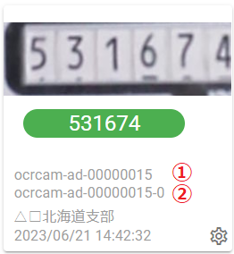

- ① デバイスID
- ② メーターID

見切れている時はマウスカーソルをかざすと詳細情報がポップ表示されます。

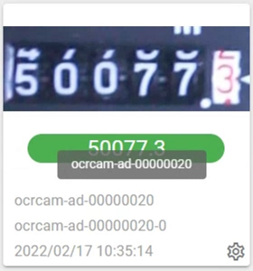

また、タイルをクリックすると``詳細画面``が開き、その日の検針履歴を確認できます。

設定ボタン  をクリックすると``デバイス一覧``を開きます。

- **ライン表示**

※``タグ検索``指定時

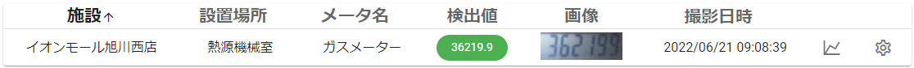

※``ID検索``指定時

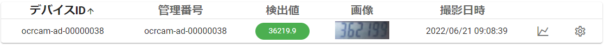

 をクリックすると``詳細画面``が開き、その日の検針履歴を確認できます。

 をクリックすると``デバイス一覧``を開きます。

また、任意のラインを選択すると``メーター詳細``に詳細情報が表示されます。

---
## メーター詳細
選択したラインに対応するOCRカメラの詳細情報を表示します。

|画像|説明|
|:----:|:----|
|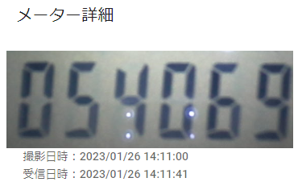|検針時のメーター画像 ``撮影日時``：端末がメーター画像を撮影した日時 ``受信日時``：クラウドがメーター画像を受信した日時|
|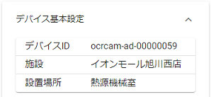|デバイス基本設定 ``デバイスID`` ``施設`` ``設置場所``|
|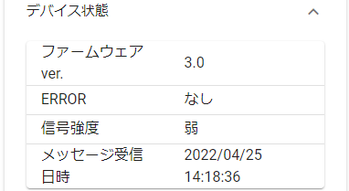|デバイス状態 ``ファームウェアver.`` ``ERROR``：ログファイルオープン失敗、時刻同期失敗、メッセージ送信失敗、不正なコンフィグ、コンフィグ取得失敗、撮影失敗、画像アップロード失敗、FWアップデート失敗、タイムアウトによるリセット ``信号強度``：RSSI値（0 に近いほど強度が高くなります） ``メッセージ受信日時``|
||メーター設定 ``適用タグ`` ``整数桁数``：OCR処理時に整数として認識する桁数 ``少数桁数``：OCR処理時に小数点以下として認識する桁数 ``使用量上限``：前回の検針値との差がこの値を超えると、アラート「使用量上限超過」が発生します ``メーター登録日時`` ``管理番号``：イオンディライト管理番号|
