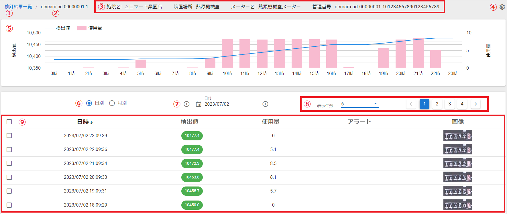
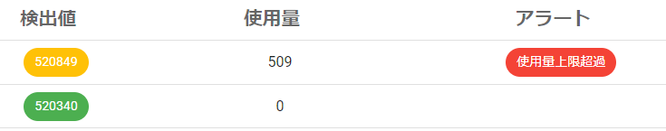

# 8. 詳細画面

指定された日付の検針履歴を表示します。

- ① 検針結果一覧　⇒``検針結果一覧``に戻ります。
- ② メーターID
- ③ 設定情報　⇒施設名、設置場所、メーター名、管理番号を表示します。
- ④ 設定ボタン　⇒``デバイス一覧``の``デバイス設定変更``ダイアログを開きます。
- ⑤ グラフ表示　⇒検針結果を``グラフ表示``します。
- ⑥ 日別/月別　⇒日別表示、月別表示を切り替えます。
- ⑦ 日付選択　⇒表示したい日付を選択します。
- ⑧ ページ選択
- ⑨ 検針履歴　⇒指定した日の``検針履歴``を表示します。

---
## 8.1 グラフ表示
検針履歴をグラフで表示します。
折れ線グラフは``検出値``、棒グラフは``使用量``を表します。横軸は時間です。

マウスカーソルをかざすとその時点の値がポップアップ表示されます。

月別表示時は、横軸のスケールが日単位になります。

---
## 8.2 検針履歴
その日の検針結果をリスト形式で表示します。

- ① チェックボックス　⇒チェックを付けると削除ボタンが左上に現れます。
- ② 日時　⇒検出日時です。
- ③ 検出値　⇒メーターの検針結果です。
- ④ 使用量　⇒前回の検出値との差分です。
- ⑤ アラート　⇒アラートが発生している場合はアラート種別が表示されます。
- ⑥ 画像　⇒検出値の判定に使用したOCRカメラ画像です。

---
### 8.2.1 検針履歴削除
チェックボックスにチェックを付けると``削除ボタン``が左上に現れます。

``削除ボタン``をクリックすると確認メッセージが表示され、``削除する``を選択すると検針結果が削除されます。

---
### 8.2.2 検出値編集

検出値をクリックすると編集ダイアログが開きます。

任意の値を入力し``保存``を選択することで検出値を修正します。

※修正後、発生していたアラートは自動で削除されます。

- **修正前**

- **修正後**

---
### 8.2.3 アラート削除

アラートをクリックすると削除確認ダイアログが開きます。

削除する場合は``はい``を選択してください。
