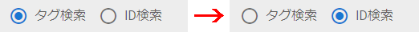
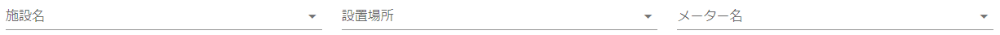
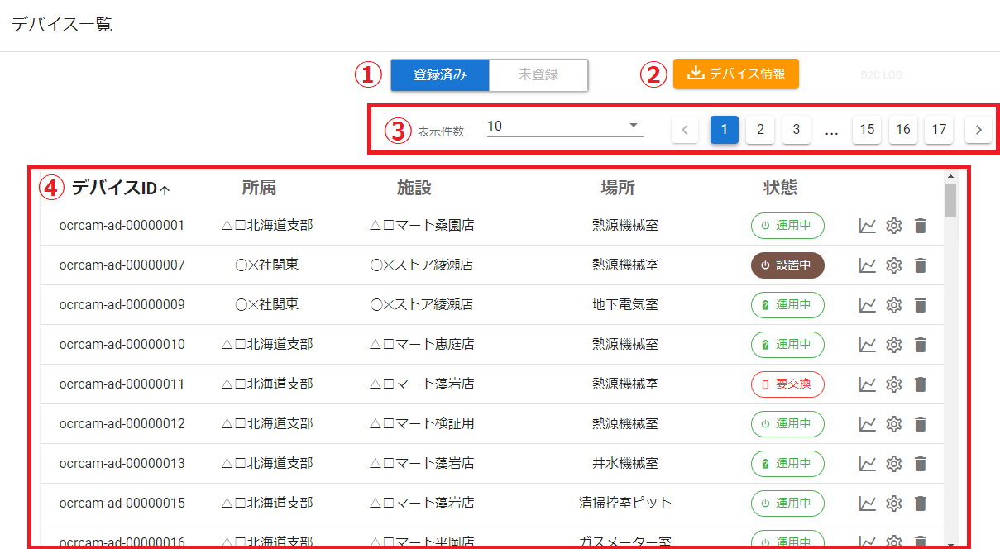
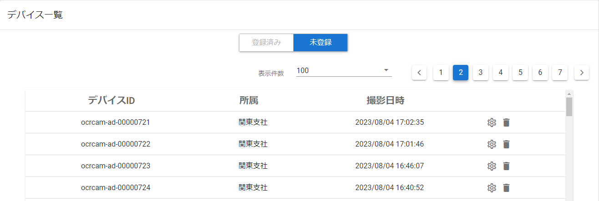
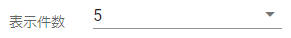
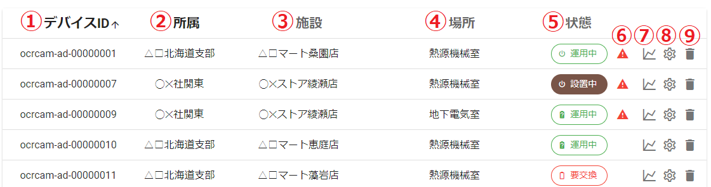
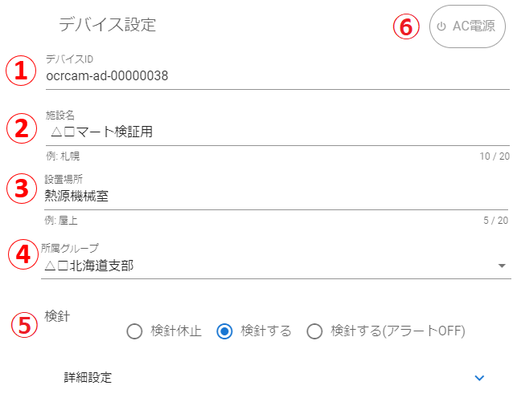
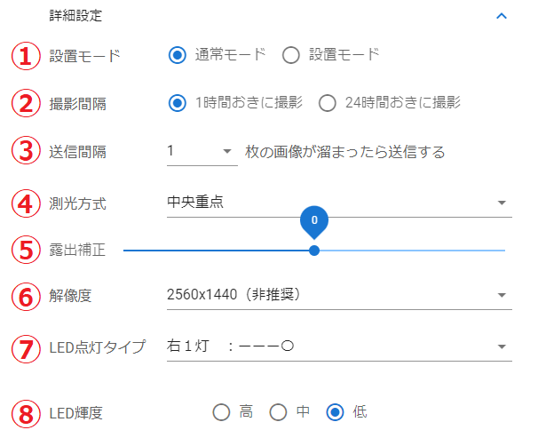
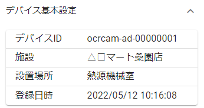
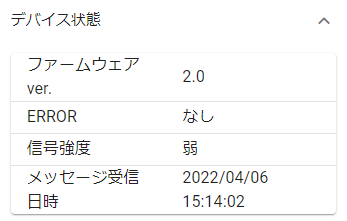

# デバイス一覧

登録済みデバイス、未登録デバイスの一覧を表示します。

- ① 検索フォーム　⇒条件を指定して登録済みデバイスの一覧を絞り込みます。
- ② デバイス一覧　⇒条件に一致するデバイスを表示します。
- ③ デバイス情報　⇒一覧で選択したデバイスの詳細情報です。

---
## 検索フォーム
条件を指定して登録済みデバイスを絞り込みます。

- ① タグ検索/ID検索 切り替え　⇒切り替えると検索条件が変わります。

- ② 検索条件　⇒条件を指定してデバイスを絞り込みます。

**タグ検索**　施設名、設置場所、メーター名を検索条件とします。

**ID検索**　デバイスIDを検索条件とします。

---
## デバイス一覧
登録済みデバイス、未登録デバイスの一覧を表示します。

- ① 登録済みデバイス/未登録デバイス 切り替え
- ② デバイス情報ダウンロードボタン
- ③ ページ選択
- ④ デバイス一覧

---
### 登録済みデバイス/未登録デバイス 切り替え
登録済みデバイス一覧と未登録デバイス一覧を切り替えることができます。
- **登録済みデバイス一覧**

- **未登録デバイス一覧**

---
### デバイス情報ダウンロードボタン
一覧に表示されているデバイスの情報をCSV形式ファイルとしてダウンロードできます。

ボタンをクリックするとダウンロードが始まります。

---
### ページ選択

1ページに表示する件数を選択します。

件数が多い場合は、ページボタンを切り替えて表示します。

---
### デバイス一覧
デバイス一覧を表示します。デバイスには登録済みデバイスと未登録デバイスの二種類があります。

- **登録済みデバイス一覧**

- ① デバイスID
- ② 所属
- ③ 施設
- ④ 場所
- ⑤ 状態
- ⑥ 警告アイコン
- ⑦ 検針結果ボタン
- ⑧ 設定ボタン
- ⑨ 削除ボタン

状態には以下の種類があります。

|状態|説明|
|:----:|:----|
||AC電源タイプ　検針中|
||電池タイプで残量60%以上　検針中|
||電池タイプで残量60%未満　検針中|
||電池タイプで残量30%未満　検針中|
||電池タイプで残量10%未満　検針中|
||電池タイプで残量不明　検針中|
||AC電源タイプ　設置モード|
||電池タイプ　設置モード|
||検針休止中（AC電源タイプ、電池タイプ　共通）|

※電池タイプのデバイスは、状態アイコンをクリックすると``電池残量リセットダイアログ``が開きます。最後に電池交換した日時を指定してリセットすると、電池残量の表示が実際の状態に近くなります。

警告アイコン  は、その端末で何らかの異常が発生していることを示します。詳細は右部のデバイス情報から確認できます。

|状態|説明|
|:----:|:----|
|機器異常(画像遅延)|メッセージ受信日時は正常だが、画像受信日時が遅延している場合|
|機器異常(メッセージ遅延)|画像受信日時は正常だが、メッセージ受信日時が遅延している場合|
|通信異常|画像撮影日時とメッセージ受信日時は正常だが、端末から通信異常に関わる通知があった場合|
|デバイス停止|画像受信日時とメッセージ受信日時が共に遅延している場合|

検針結果ボタン  をクリックすると``詳細画面``が開き、その日の検針履歴を確認できます。

設定ボタン  をクリックすると``デバイス設定変更ダイアログ``が開きます。

削除ボタン  をクリックすると確認ダイアログが開きます。

削除したい場合は``削除する``をクリックしてください。

- **未登録登デバイス一覧**

- ① デバイスID
- ② 所属
- ③ 撮影日時
- ④ 設定ボタン
- ⑤ 削除ボタン

``未登録デバイス一覧``には、画像のアップロードが完了したデバイスが表示されます。  
(画像がアップロードされてから、``未登録デバイス一覧``に表示されるまで**最大15分程度**かかります)

設定ボタン  をクリックすると``デバイス登録ダイアログ``が開きます。

削除したい場合は、削除ボタン  をクリックしてください。

---
### デバイス設定変更ダイアログ
``登録済みデバイス一覧``で設定ボタンをクリックすると表示します。

- **デバイス設定**

- ① デバイスID
- ② 施設名　⇒上限20文字、空白文字禁止、半角記号は @、ピリオド、ハイフン、アンダーバーのみ使用可能。
- ③ 設置場所　⇒上限20文字、空白文字禁止、半角記号は @、ピリオド、ハイフン、アンダーバーのみ使用可能。
- ④ 所属グループ　⇒デバイスが所属しているグループを表示します。
- ⑤ 検針　⇒``検針休止``、``検針する``、``検針する(アラートOFF)`` から選択します。
- ⑥ 状態アイコン　⇒給電タイプや設置モードの状態を表示します。

- **デバイス詳細設定**

詳細設定が閉じている場合は、右側の ``⋁`` マークをクリックして開きます。

詳細設定はファームウェアのバージョンによって項目が異なります。

**version 1.4**

**version 2.x**

**version 3.x**

- ① 設置モード　⇒``通常モード`` か ``設置モード`` を選択します。設置モードは設置時の動作確認用モードです。設置作業が完了したら必ず「通常モード」に戻してください。また、設置モード中も IoT Station への送信は行われます。送信を止めたい場合は、別途「IoT Stationへ検針値を送信する」 を OFF に設定してください。
- ② 撮影間隔(時)　⇒検針間隔を時間単位で指定します。設置モード時は設定できません。
- ③ 送信間隔(時)　⇒検針結果の送信間隔を指定します。撮影間隔より長く設定すると検針結果がまとめて送信されます。設置モード時は設定できません。
- ④ 撮影開始時間帯　⇒指定された時間から検針を開始します。設置モード時は設定できません。
- ⑤ 撮影終了時間帯　⇒指定された時間まで検針します。設置モード時は設定できません。
- ⑥ 測光方式　⇒``平均``、``中央重点``、``スポット``、``マルチ`` から選択します。
- ⑦ 露出補正　⇒``-6~6`` の範囲から選択します。 (-2Ev~+2Ev, 1/3Ev step)
- ⑧ 解像度　⇒``640x480``、``1280x960``、``2048x1536``、``2560x1440（非推奨）`` から選択します。
- ⑨ LED点灯タイプ　⇒給電方式がAC電源か電池でリストが変わります。
AC電源（``全灯　　：〇〇〇〇``、``左右２灯：〇ーー〇``、``中央２灯：ー〇〇ー``、``左１灯　：〇ーーー``、``右１灯　：ーーー〇``）、電池（``上側のみ``、``下側のみ``、``全灯``）
- ⑩ LED輝度　⇒``高``、``中``、``低`` から選択します。

- **メーター設定**

- ① 削除ボタン　⇒表示中のメーター設定を削除します。メーター設定が一つしかない場合は削除できません。
- ② カメラ画像　⇒カメラから送られてきた画像です。メーター読み取り枠の設定に使用します。
- ③ 回転ボタン　⇒クリックすると画像を回転します。取り付け環境の都合で画像が横向きや逆さになっている場合に使用してください。
- ④ メーター切替えタブ　⇒メーター設定を切替えます。メーター設定は、追加ボタンをクリックすることで最大4つまで設定可能です。
- ⑤ 施設管理番号　⇒上限20文字、半角英数字、空白文字禁止、半角記号は @、ピリオド、ハイフン、アンダーバーのみ使用可能。
- ⑥ IoT Stationへ検針値を送信する　⇒OFFにすると IoT Station に検針値を送信しません。
- ⑦ メーター名　⇒上限20文字、空白文字禁止、半角記号は @、ピリオド、ハイフン、アンダーバーのみ使用可能。
- ⑧ タグ選択　⇒選択したタグを適用します。
- ⑨ メーター種別　⇒``デジタル``、``カウンター``、``検針しない(表示のみ)``から選択します。
- ⑩ 整数桁数　⇒メーターの整数部の桁数を指定します。
- ⑪ 小数桁数　⇒メーターの小数部の桁数を指定します。
- ⑫ メーター構成　⇒上限20文字、半角英数字、半角記号は @、ピリオド、ハイフン、アンダーバーのみ使用可能。
- ⑬ 使用量上限　⇒1～9999の整数値を指定します。
- ⑭ ミラー反転　⇒``反転なし``、``左右反転``、``上下反転``から選択します。
- ⑮ memo　⇒メモを保存します。（上限500文字）

---
#### メーター位置の指定と調整
自動検針をするために、メーター読み取り枠を次の画像のように合わせてください。

メーターの向きが回転している場合は、正しい向きになるよう調整してください。  
左下の回転ボタンをクリックすると画像が回転します。

|調整前|調整後|
|:----:|:----:|
|||
|||

メーター読み取り枠にマウスカーソルをかざしてドラッグすると枠線を移動できます。

メーター読み取り枠上の点にマウスカーソルをかざしてドラッグすると枠の大きさを調整できます。

メーター読み取り枠の外側をダブルクリックすると画像表示移動モードに切り替えることができます。
画像表示移動モードでは、上下左右に画像を移動させることができます。  

マウスホイールを上下すると、画像を拡大/縮小することができます。

---
#### メーター情報の設定

``施設管理番号``、``メーター名``、``メーター種別``、``整数桁数``、``小数桁数``、``メーター構成``、``使用量上限``を設定してください。  

``メーター種別``は、次の表を参考に選択してください。

|メーター種別|説明|サンプル画像|
|:----------:|:--:|:----------:|
|デジタル|液晶等のデジタル表示式メーター||
|カウンター|回転式・ダイヤル式のアナログ表示メーター||

※検針せず画像のみ表示する場合は``検針しない(表示のみ)``を選択してください。

設定が完了したら、``設定を変更する``をクリックしてください。

デバイスの設定が完了すると、ポップアップが表示されます。

これで設定完了です。

---
### デバイス登録ダイアログ
``未登録デバイス一覧``で設定ボタンをクリックすると表示します。

画面操作は ``9.2.5 デバイス設定変更ダイアログ`` と同様です。

---
## デバイス情報
選択したラインに対応するOCRカメラのデバイス情報を表示します。

|画像|説明|
|:----:|:----|
||カメラ画像（全体） ``撮影日時``：端末が画像を撮影した日時 ``受信日時``：クラウドが画像を受信した日時 ``画像履歴表示ボタン``：過去の撮影画像履歴を表示 ``警告メッセージ``：端末で異常発生の疑いがある場合に表示|
||デバイス基本設定 ``デバイスID`` ``施設`` ``設置場所`` ``登録日時``|
||デバイス詳細設定 ``電源/電池モード``：電源、電池 ``撮影間隔(時)`` ``送信間隔(時)`` ``撮影開始時間帯`` ``撮影終了時間帯`` ``測光方式``：平均、中央重点、スポット、マルチ ``露出補正``：-6~6 ``LED点灯タイプ``：全灯　　：〇〇〇〇、左右２灯：〇ーー〇、中央２灯：ー〇〇ー、左１灯　：〇ーーー、右１灯　：ーーー〇 ※電池端末は　上側のみ、下側のみ、全灯|
||デバイス状態 ``ファームウェアver.`` ``ERROR``：ログファイルオープン失敗、時刻同期失敗、メッセージ送信失敗、不正なコンフィグ、コンフィグ取得失敗、撮影失敗、画像アップロード失敗、FWアップデート失敗、タイムアウトによるリセット ``信号強度``：RSSI値（0 に近いほど強度が高くなります） ``メッセージ受信日時``：デバイスから最後にメッセージを受信した日時|

---
### 撮影画像履歴
カメラ画像右下の画像履歴表示ボタンをクリックすると、過去のカメラ画像が確認できます。

- ① 表示タイプ　⇒期間指定は過去``15日``、``30日``、``45日``、``60日``から選択し、各日1枚の画像を表示します。日付指定は``指定した日の全ての画像``を表示します。
- ② 指定フォーム　⇒期間指定の場合はラジオボタン、日付指定の場合は日付入力フォームに変化します。
- ③ 取得ボタン　⇒クリックすると画像を取得して表示領域に表示します。
- ④ ページ切り替え　⇒表示する画像を切り替えます。画像は``最大３つ``まで同時に表示します。
- ⑤ 表示領域　⇒画像の表示領域です。

