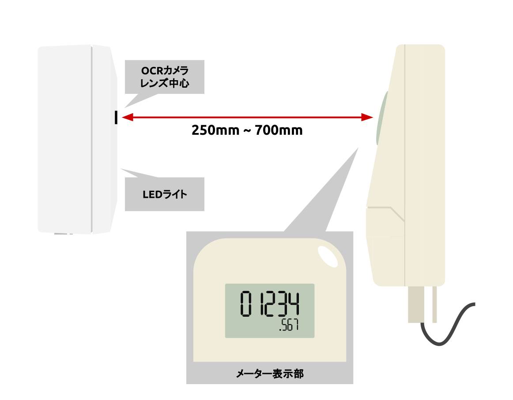
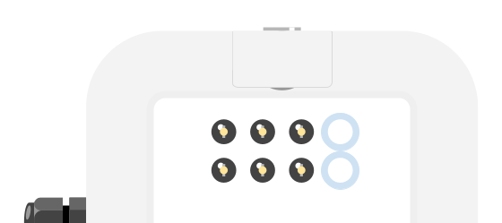
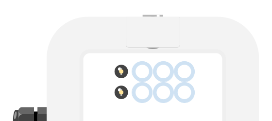

# 2. 設置手順

### 2.1 設置ルール

次のルールに注意しながらOCRカメラを設置してください。

- **カメラレンズがメーター表示部の中心にくる位置に設置する**
- **OCRカメラ本体とメーターとが平行になるように設置する**
- **カメラレンズからメーター表示部までの距離を250mm〜700mmに収める**
  - 250mmより近くするとレンズの焦点が合わずボケてきますが、多くの場合はメーター数値を読み取ることができます。「3.3 近接設置するときの注意点」をご参照ください

|側面図|上面図|
|:----:|:----:|
|||

傾斜のあるカバーやレンズがついているようなメーターでは、LEDライトの光が反射してしまい、正しく数値を読み取れないことがあります。  
この場合、LEDライトが下になるようOCRカメラを逆さにして設置してください。

|側面図|上面図|
|:----:|:----:|
|||

設置が完了したら、**本体ラベルに記載されているDevice ID(``ocrcam-ad-``から始まる文字列)と設置場所を控えておいてください。**

どうしてもメーターに光が反射してしまうときは、付録のNG設置例も参考にしてください。

### 2.2 電源投入

ACアダプタをコンセントに挿し電源を入れてください。  
LED1が点滅しはじめます。このとき、OCRカメラは自身のデバイス情報をクラウドに送信しています。

約20秒〜数分後、一度LEDが消灯したあと両端のLEDが点灯し、メーターを撮影します。  

撮影後、LED1が点灯しLED2が点滅しはじめます。  
このとき、OCRカメラは撮影した画像をクラウドへアップロードしています。  

アップロードが完了すると、LED1とLED2が点灯しLED3が点滅しはじめます。  

この状態になったら、クラウド上での画像確認へと進んでください。  
LEDが違う表示をしている場合は、付録の**OCRカメラ基本動作**を参照してください。

また、電源投入から画像のアップロードが完了するまでの時間は、設置場所の電波環境によって異なります。

### 2.3 画像の確認

Webブラウザで所定のURLにアクセスし、ログインしてください。

サイドメニューから``デバイス一覧``を選択し、``未登録``ボタンをクリックすると、``デバイス一覧``に画像アップロードが完了したOCRカメラが表示されます。  
(設置したOCRカメラが``デバイス一覧``に表示されるまで**最大15分程度**かかります)

設定したいOCRカメラの歯車アイコンをクリックしてください。設定ダイアログが開きます。

画像表示移動モードでは、上下左右に画像を移動させることができます。  
画像表示移動モードは、メーター読み取り枠の外側をダブルクリックすると切り替えることができます。  

マウスホイールを上下すると、画像を拡大/縮小することができます。

### 2.4 デバイスの登録

#### 2.4.1 メーター位置の指定と調整

自動検針をするために、メーター読み取り枠を次の画像のように合わせてください。

メーターの向きが回転している場合は、正しい向きになるよう調整してください。  
左下の回転アイコンをクリックすると画像が回転します。

|調整前|調整後|
|:----:|:----:|
|||
|||

#### 2.4.2 メーター情報の設定

``店舗名``、``設置場所``、``メーター名``、``メーター種別``、``整数桁数``、``小数桁数``を設定してください。  

``メーター種別``は、次の表を参考に選択してください。

|メーター種別|説明|サンプル画像|
|:----------:|:--:|:----------:|
|デジタル|液晶等のデジタル表示式メーター||
|カウンター|回転式・ダイヤル式のアナログ表示メーター||

設定が完了したら、``設定を登録する``をクリックしてください。

デバイスの登録が完了すると、ポップアップが表示されます。

これで設置完了です。
