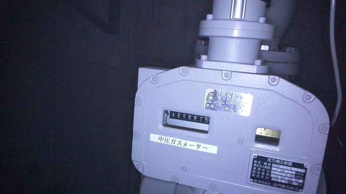
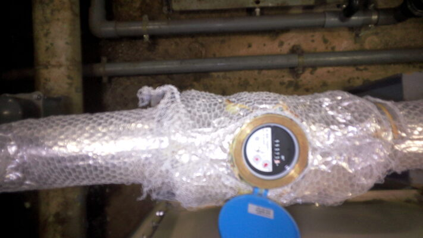
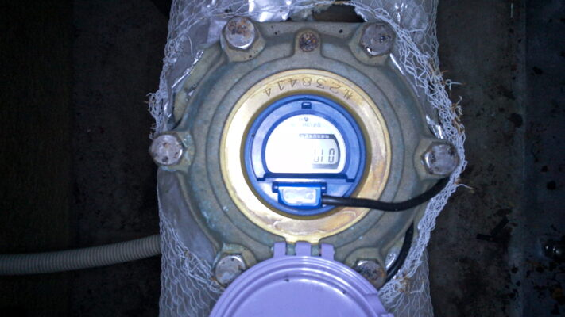
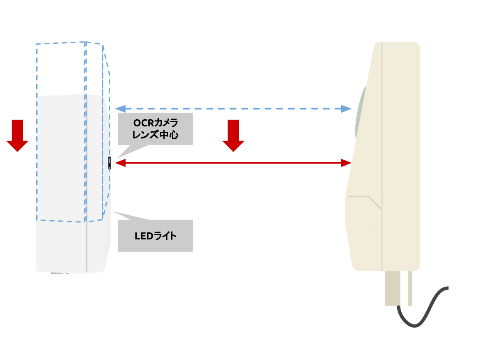
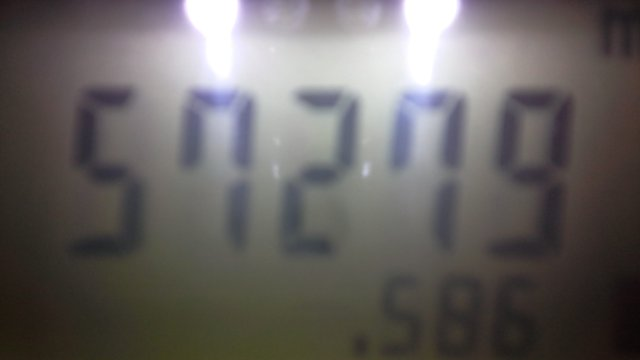
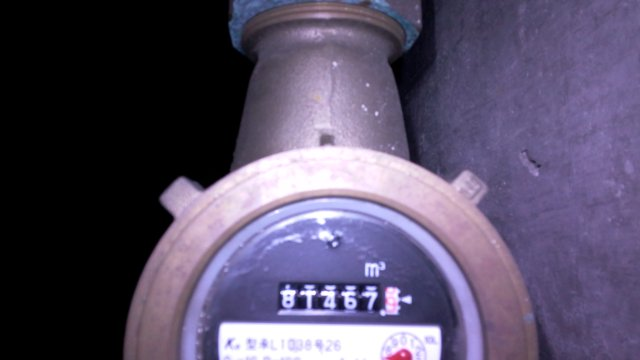

## 3. 付録
### 3.1 OCRカメラ基本動作

OCRカメラの電源投入後初回の撮影では、どのような動作をしているのかLEDで確認することができます。

#### 3.1.1 デバイス情報送信

ACアダプタをコンセントに挿し電源を入れてください。  
LED1が点滅しはじめます。このとき、OCRカメラは自身のデバイス情報をクラウドに送信しています。

#### 3.1.2 撮影

約20秒〜数分後、一度LEDが消灯したあと両端のLEDが点灯し、メーターを撮影します。  

#### 3.1.3 画像のアップロード

撮影後、LED1が点灯しLED2が点滅しはじめます。  
このとき、OCRカメラは撮影した画像をクラウドへアップロードしています。  

#### 3.1.4 コンフィグの取得

アップロードが完了すると、LED1とLED2が点灯しLED3が点滅しはじめます。  
このとき、OCRカメラはクラウドからコンフィグファイルを取得しています。

現在のコンフィグと取得した新しいコンフィグとの間に差分があった場合は、新しいコンフィグを保存して自動で再起動します。  
再起動後、新しいコンフィグを反映して再度撮影とアップロードを行います。  
同一だった場合は、ファームウェアアップデートの確認とエラーチェックをした後スリープします(LED全消灯)。

#### 3.1.5 ファームウェアアップデート

全消灯・LED1からLED4が順番に点灯を繰り返しているとき、OCRカメラはファームウェアアップデートを実行しています。  
ファームウェアアップデートは必要なときのみ自動で実行されます。  
ファームウェアアップデート実行中は**絶対に電源を切らないでください**。

アップデートが完了すると自動で再起動し、新しいファームウェアで撮影とアップロードを開始します。

#### 3.1.6 エラーチェック

動作中にエラーが発生した場合、LED1、LED2、LED3が点灯しLED4が点滅しはじめます。  
このとき、OCRカメラはエラーコードをクラウドへ送信しています。  

#### 3.1.6 動作完了

送信が完了したら、通常終了したときと同様にスリープします(LED全消灯)。

初回動作以降、撮影時とファームウェアアップデート時以外のLED点灯表示は行いません。

### 3.2 NG設置例

次のような画像では、メーターの数値を正しく読み取ることができません。

|サンプル画像|NG要因|対策例|
|:----:|:---------:|:-----:|
||画像に対してメーター表示部が斜めになっている|OCRカメラをメーターに対して水平に設置する|
||画像がぼやけている （人が見てもメーター数値を判別できない）|OCRカメラをメーターに近づけるか、遠ざけるかして、人が見てメーター数値を判別できる位置に設置する|
||メーター表示部に光が反射している|OCRカメラをメーターに対して少し水平にずらして設置する|

光の反射でメーターの数値が読み取れないときは、メーター表示部からLEDライトを離すように、OCRカメラを平行にずらして設置してください。

|側面図|
|:----:|
||

このとき、メーター表示部がカメラの画角に収まれば良いので、カメラレンズをメーターに向ける必要はありません。  
メーターに向けてしまうと、反射が改善されにくくなってしまうため避けてください。

### 3.3 近接設置するときの注意点

カメラレンズからメーター表示部までの距離は250mm〜700mmを推奨しますが、250mm以下でも多くの場合はメーターの数値を読み取ることが可能です。ただし、メーターがカメラの画角内に収まらなくなるので、近くても120mm程度までに留めるようにしてください。

レンズの焦点が合わずメーターがボケやすくなるので、メーターの数値を見て人間の目で判別可能かを確認してください。被写界深度が浅くなるので、背景は問題なくてもメーターがボケる場合があります。

人間が問題なく判別できる程度のボケであればメーター数値は読み取り可能です。

|サンプル画像|説明|
|:----:|:----:|
||画角ギリギリの近接状態です。|
||奥の方はピントが合っているように見えますが、メーターの数値はややボケています。|
