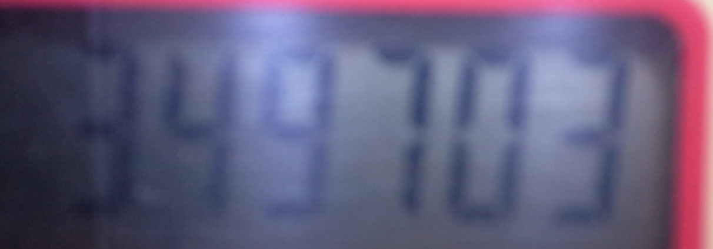

# 3. 誤検出させないために

誤検出しやすい例を示します。設置および登録時にご留意ください。

### 3.1. 設定間違い

デバイス登録時に、「メーター種別」を設定する箇所があります。
デジタルメータなのに「カウンタ」になっていたり、カウンタメータなのに「デジタル」になっていたりすると、正しく検出できません。誤検出が著しい場合は、メーター種別の設定が正しいかも確認してください。

### 3.2. 例1

上部の ㎥ などや、下部の切れたアイコン表示を誤検出する恐れがあります。
検出領域設定時は、なるべく使用したい数値の領域のみを指定するようにしてください。

この例の場合、設定により以下のように検出できます。

- 整数6桁, 小数0桁で設定すると `027271` と検出
- 整数6桁, 小数3桁で設定すると `027271.264` と検出

例えば、目視確認用に小数部まで含めて領域指定をするが、OCR値としては整数値だけあればよいという設定が可能です。

### 3.3. 例2

暗いのでコントラストがはっきりしません。一番左の "3" を検出できない恐れがあります。
追加学習で改善する場合があります。
