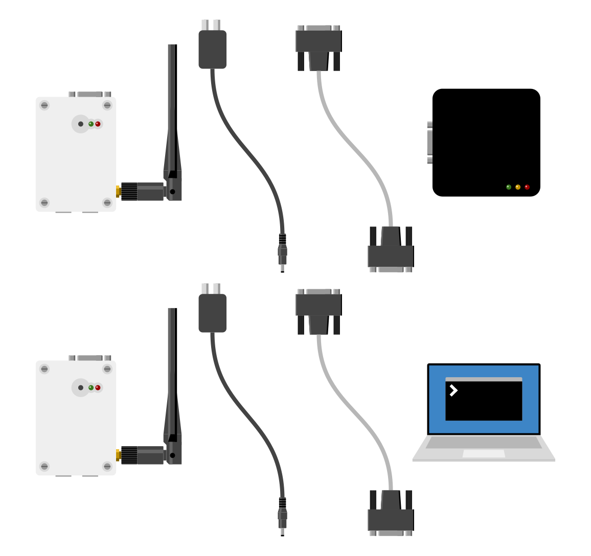
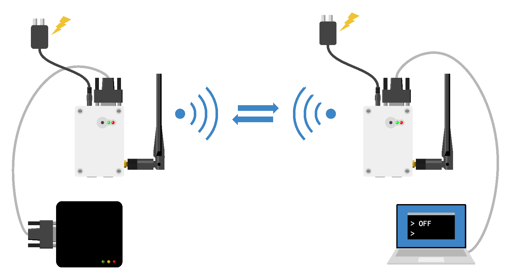

# Getting Started

## 準備

次のものを用意してください。

- Serial LTE Converter 2台
- 電源アダプタ 2個
- シリアルケーブル 2本
- シリアル通信機器 1台
- PC 1台

## シリアル機器と接続

それぞれを次のように接続し、電源を入れてください。

Serial LTE Converterの2つのLED(赤と緑)が点灯すれば、起動完了です。

起動後、お使いのシリアル通信機器が相互にデータを送受信できていることを確認してください。

## That's it!

これだけです。
