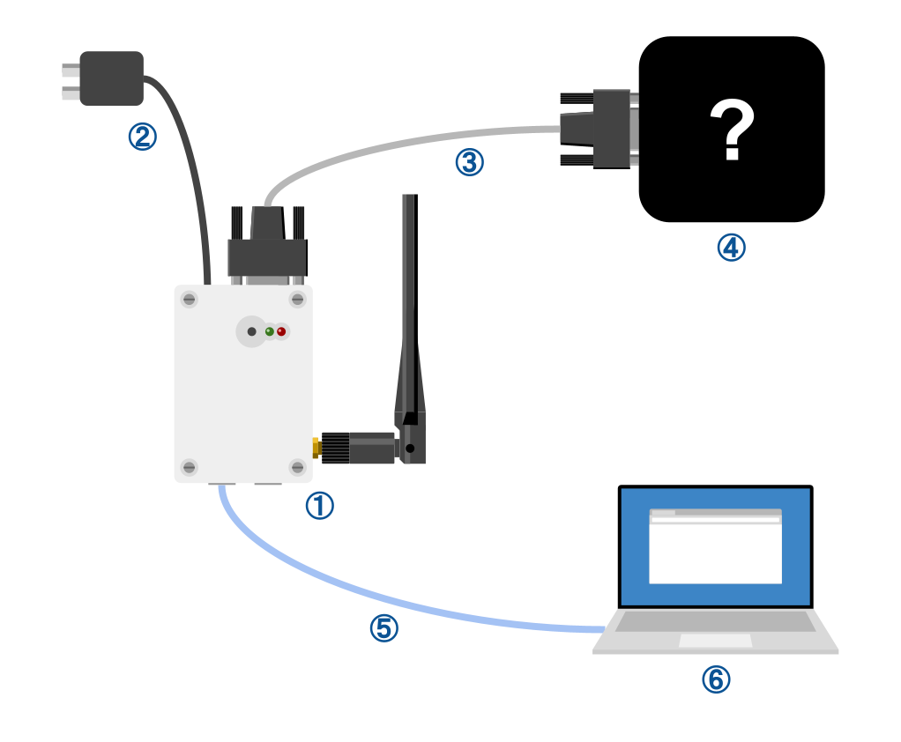
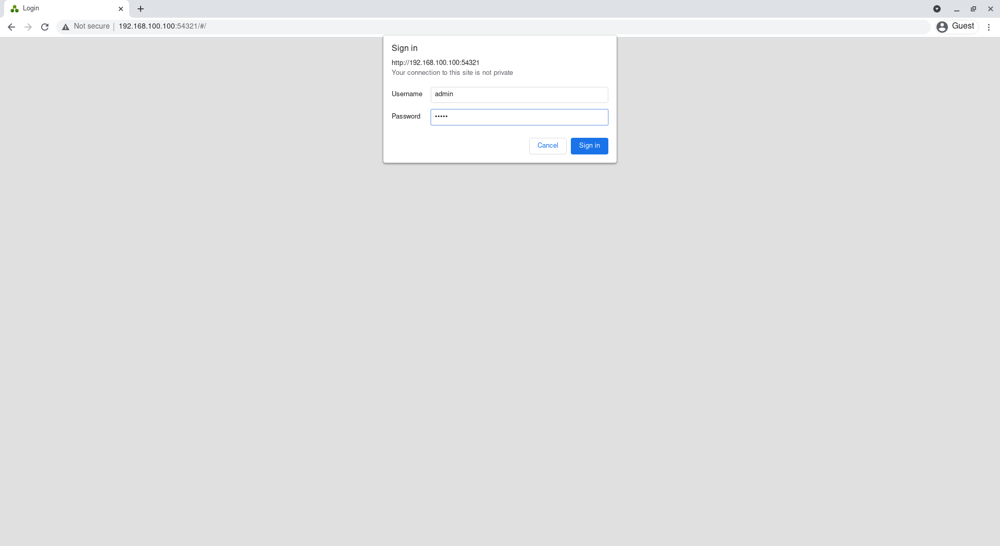

# 初期設定

## 接続

初期設定をするために、次の図のように機器を接続します。

- ① Serial LTE Converter
- ② ACアダプター
- ③ RS-232Cケーブル
- ④ RS-232C接続の対向機器
- ⑤ LANケーブル
- ⑥ PC

## 電源投入

ACアダプタを電源へ接続し、Serial LTE Converterの電源を入れます。

## WebUIへのアクセス

PCのネットワークを適宜設定し、ウェブブラウザで``192.168.100.100:54321``にアクセスします。

正しくアクセスできると、ログインフォームが表示されます。

出荷状態では、デフォルトのユーザー名とパスワードは次のとおりです。

|ユーザー名|パスワード|
|----------|----------|
|admin     |admin     |

入力すると、Serial LTE ConverterのWebUIにログインすることができます。

