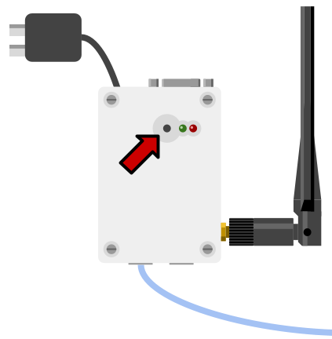
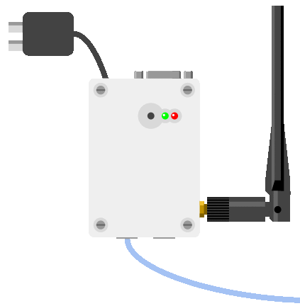
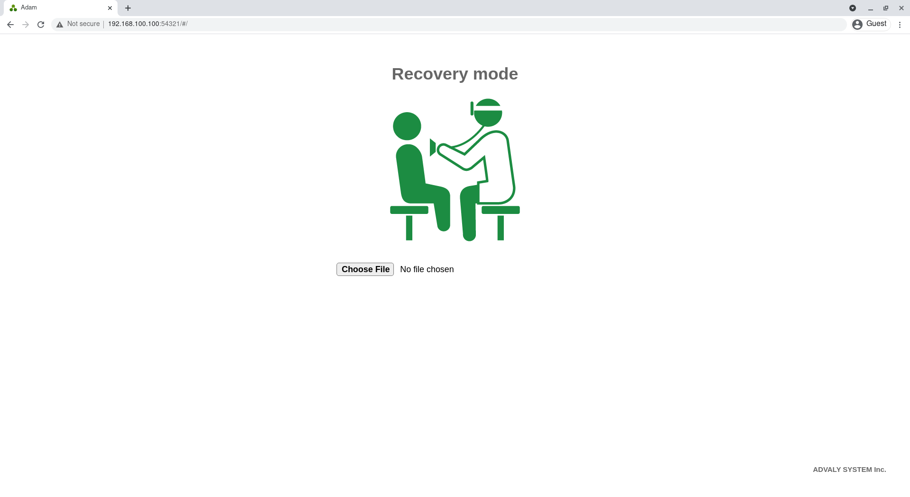
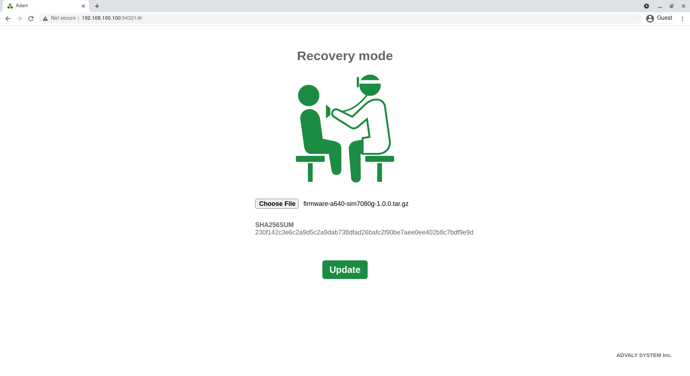
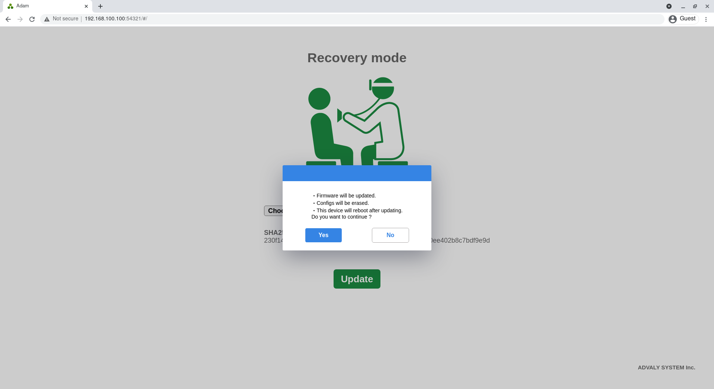
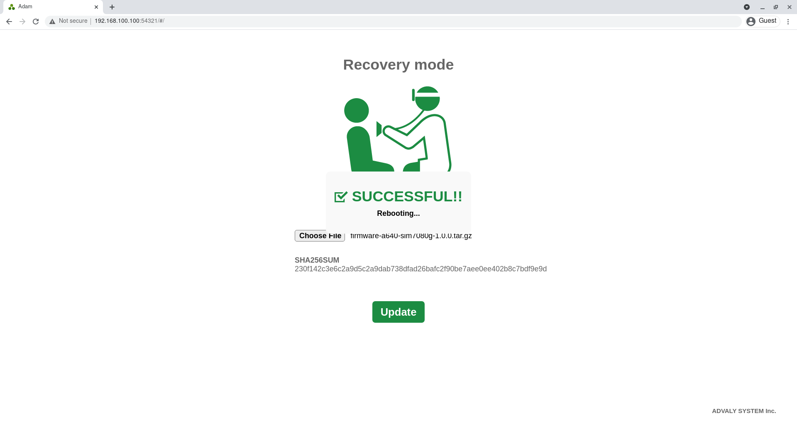

# トラブルシューティング

## リカバリモード

リカバリモードを使用すると、**ファームウェアイメージを強制的に書き込み、設定の初期化をする**ことができます。

何らかの不具合が発生したり、設定を忘れてしまったことで本体が不明な状態になってしまった場合に有効です。

### リカバリモードで起動

2つのLEDの横に並んでいるボタンを押しながら、電源を入れます。

30秒程度待つと、次のように緑LEDが点灯、赤LEDが点滅した状態になります。

これでリカバリモードでの起動完了です。

### WebUIへのアクセス

PCのネットワークを適宜設定し、ウェブブラウザで``192.168.100.100:54321``にアクセスします。

正しくアクセスできると、リカバリモードのUIが表示されます。

``Choose File``をクリックし、書き込むファームウェアイメージを選択すると、アップロードが開始します。

アップロードが完了すると、ファイル名とSHA256SUMが表示されます。

``Update``をクリックすると、ダイアログが表示されます。``Yes``をクリックすると、アップデートが開始します。

アップデートが完了すると、次のようなダイアログが表示され、自動で再起動します。このとき、**設定もすべて初期化**されます。

再起動完了後、デフォルトの``192.168.100.100:54321``でWebUIにアクセスすることができます。
